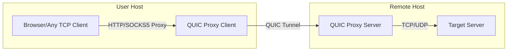
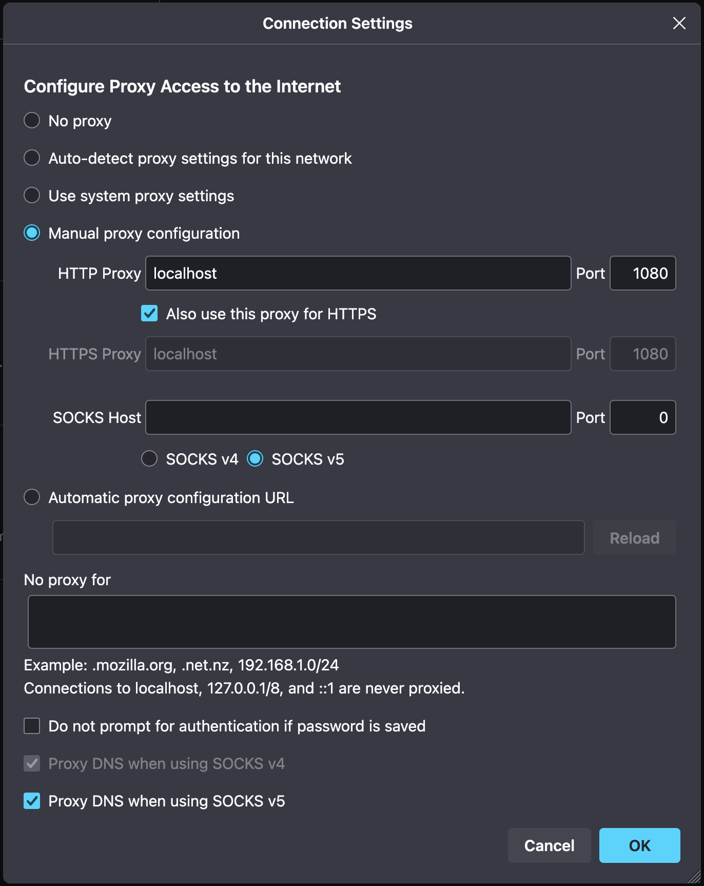
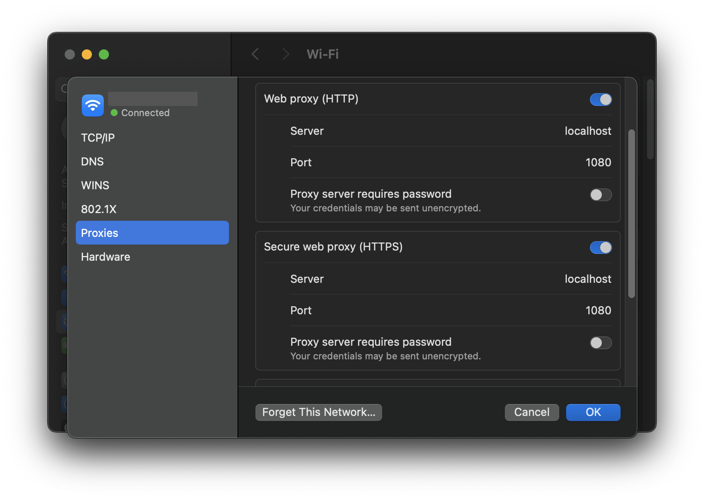

# QUIC Proxy Tunnel

A high-performance HTTP/SOCKS5 proxy that tunnels traffic over QUIC connections. This project provides both client and server components, enabling secure and efficient proxying of HTTP(S) and arbitrary traffic using the QUIC protocol.

## Features
- HTTP proxy client or SOCKS5 proxy client (configurable) that forwards requests over QUIC (Sock5 proxy is not fully implemented yet)
- QUIC server that relays traffic to target destinations
- Basic authentication support
- TLS encryption for secure communication
- Optional profiling support

## How it works



## Requirements
- Go 1.18 or newer
- QUIC-Go library

## Building and Running

Clone the repository:

```sh
git clone https://github.com/SonomaTomcat/quic-proxy-tunnel.git
cd quic-proxy-tunnel
```

Build the project:

```sh
make build
```

Run the server:

```sh
make run-server
```

Run the client:

```sh
make run-client
```

## Testing
### 1 Certificate

Before running the server, generate a certificate and key using one of the following commands:

#### ECDSA Key and Certificate Generation (More compatible, but less efficient)

```sh
mkdir -p test
openssl ecparam -genkey -name prime256v1 -out test/test.key
openssl req -new -x509 -key test/test.key -out test/test.crt -subj "/CN=example.com" -days 36524
```

#### ED25519 Key and Certificate Generation (More efficient, but not supported by MacOS and Windows yet)

```sh
mkdir -p test
openssl req -x509 -nodes -newkey ed25519 \
 -keyout test/test.key -out test/test.crt \
 -subj "/CN=example.com" -days 36524
```
View Certificate Information:
```shell
openssl x509 -in test/test.crt -text -noout
```
This will create `test/test.crt` and `test/test.key` for use in the server configuration.

### 2 Configuration

Both client and server require a JSON configuration file. Example configurations are provided in the `test/` directory.

#### Client Configuration Example:
```json
{
  "listen": 1080,
  "listenType": "http",
  "remoteAddr": "1.2.3.4:8443",
  "skipCertVerify": true,
  "auth": "user:pass",
  "logLevel": "INFO",
  "profile": false
}
```
- `listen`: The local port the proxy will listen on (e.g., 1080).
- `listenType`: Proxy type, `http` for HTTP/HTTPS proxy, `socks5` for SOCKS5 proxy.
- `remoteAddr`: The address of the remote QUIC server (host:port).
- `skipCertVerify`: Whether to skip TLS certificate verification (useful for self-signed certificates or testing).
- `auth`: Username and password for proxy authentication, in the format `user:password`.
- `logLevel`: Log output level. Supported values: `DEBUG`, `INFO`, `NOTICE`, `WARNING`, `ERROR`, `CRITICAL`.
- `profile`: Enable pprof profiling for performance analysis (exposes pprof on localhost:6060).

#### Server Configuration Example:
```json
{
  "listen": 8443,
  "cert": "test/test.crt",
  "key": "test/test.key",
  "auth": "user:pass",
  "logLevel": "INFO",
  "profile": false
}
```
- `listen`: The port the QUIC server will listen on (e.g., 8443).
- `cert`: Path to the TLS certificate file used for QUIC encryption.
- `key`: Path to the TLS private key file used for QUIC encryption.
- `auth`: Username and password for proxy authentication, in the format `user:password`.
- `logLevel`: Log output level. Supported values: `DEBUG`, `INFO`, `NOTICE`, `WARNING`, `ERROR`, `CRITICAL`.
- `profile`: Enable pprof profiling for performance analysis (exposes pprof on localhost:6060).

### 3 Running with Configuration
To run the client or server with a specific configuration file, use the `--config` flag:
#### Run the client with configuration:
```sh
qp-tunnel client --config test/client.json
```

#### Run the server with configuration:
```sh
qp-tunnel server --config test/server.json
```

### 4 Testing the Proxy

#### Curl
You can test the proxy using `curl` or any HTTP client that supports HTTP or SOCKS5 proxies.

```sh
curl -x http://localhost:1080 https://ipinfo.io
```


#### Browser Configuration

To use the proxy in your browser, set the HTTP/HTTPS proxy to `127.0.0.1:1080` (or the port you configured in `client.json`).

- In Chrome/Edge: Go to system proxy settings and set the HTTP/HTTPS proxy.
- In Firefox: Go to Preferences > Network Settings > Manual proxy configuration.



#### MacOS Proxy Configuration


> System Preferences > Network > Wi-Fi > Your Wi-Fi Name > Details... > Proxies
>
> Web Proxy (HTTP) > Enable and set to localhost:1080
>
> Secure Web Proxy (HTTPS) > Enable and set to localhost:1080
>


#### Windows Proxy Configuration
> Settings > Network & Internet > Proxy > Manual proxy setup
>> Address: localhost
>>
>> Port: 1080

---

## License

This project is licensed under the MIT License.

---

For questions, issues, or contributions, please open an issue or pull request on GitHub.
